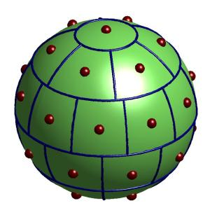

# EqualSpherePartition
&emsp;**ACM_EqualSphere** provides a much cut down module to performing partition of the surface of a sphere into regions of equal area.

 
## References:
1. Leopardi P. A partition of the unit sphere into regions of equal area and small diameter[J]. Electronic Transactions on Numerical Analysis Etna, 2006, 25(1):2006.
2. http://eqsp.sourceforge.net/
3. https://sourceforge.net/projects/eqsp/
 
 ## Contact and Feedback :email:
  Author: Zheng Gong  
  E-Mail: gongzheng_justin@outlook.com
